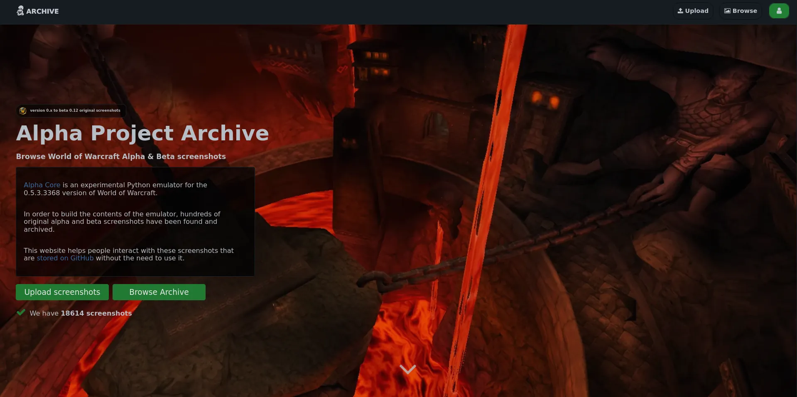
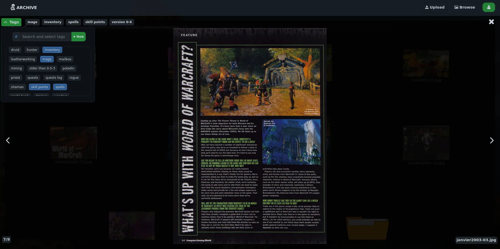
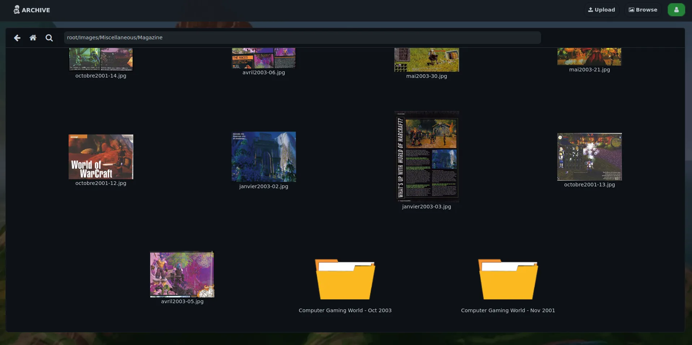

ALPHA ARCHIVE WEBSITE
===================


[Alpha Core](https://github.com/The-Alpha-Project) is an experimental Python emulator for the 0.5.3.3368 version of World of Warcraft.

In order to build the contents of the emulator, hundreds of original alpha and beta screenshots have been found and archived.

This website helps people interact with these screenshots that are stored on GitHub without the need to use it. You can see it live here : [Alpha Archive Website](https://archive.thealphaproject.eu/)







INSTALLATION
------------

This project was created with React for the frontend part and Django Rest Framework for the backend part. 

BACKEND 

(Created with python 3.10.6)

- Create Python virtual env and run ```pip install -r requirements.txt```
- Create a mysql database named ```alpha_archives```
- Modify `backend/config/settings.py` with database informations
- Create database tables with ```python manage.py makemigrations``` and ```python manage.py migrate```
- You need to clone [Alpha-Project-Archives](https://github.com/The-Alpha-Project/Alpha-Project-Archive) in ```/media/``` folder
- Go to ```database_builder``` folder and run ```python main.py``` to build elements and create thumbnails
- To run server ```python manage.py runserver```
- Go to ```automated_update``` folder, you can automate cron job for updating Alpha-Project-Archive and rebuild database with ```python main.py```

FRONTEND

(Created with node 17.9.1 and npm 8.11.0)

- Run ```npm install``` to install dependencies
- Change ```API_URL``` in ```frontend/config/api.js`` with API url like ```http://localhost:8000/```
- Run ```npm start```


DEPLOY

- Change Django secret key located in `backend/config/settings.py`
- Dont forget to add your domain name in ```/backend/config/settings.py```  ```ALLOWED_HOSTS=["yourDomain.com"]```
- Serve Django API with gunicorn
- Make react build with ```npm run build```
- Configure Nginx like this : 

```
server {
    server_name DOMAIN.COM www.DOMAIN.COM;
    root /YourPath/Alpha-archives-website/frontend/build;
    index index.html index.htm index.nginx-debian.html;

    location / {
        try_files $uri $uri/ /index.html;
    }

    location /api {
        include proxy_params;
        proxy_pass http://127.0.0.1:8000;

    }

    location /media {
        autoindex on;
        alias /YouPath/Alpha-archives-website/backend/media;
    }

}
```

DOCUMENTATION
-----------

You can find database schema and usecases for all actors in `docs` folder.
Api endpoints documentation is avalaible at `http://localhost:8000/api/v1/endpoints` when the django dev server is launched.